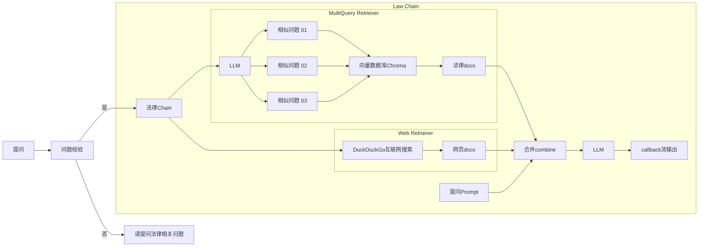

<div align="center">
  

[](https://www.gradio.app/)
[](https://twitter.com/billvsme)

</div>

法律AI助手
=========

法律AI助手，法律RAG，通过倒入全部200+本法律手册、网页搜索内容结合LLM回答你的问题，并且给出对应的法规和网站，基于langchain，openai，chroma，duckduckgo-search, Gradio

## Demo
[https://law.vmaig.com/](https://law.vmaig.com/)

**用户名**: username  
**密码**:  password  

## 原理

基于langchain链式调用，先按条切分法律条文，导入向量数据Chroma。
问答相关问题时，先通过相似度搜索向量数据，获取相关法律条文，然后通过DuckDuckGo互联网搜索相关网页，然后合并法律条文和网页内容，对问题进行回答。

**初始化init**


**提问流程**



## 初始化运行环境

```
# 创建.env 文件
cp .env.example .env

# 修改.env 中的内容
vim .env

# 安装venv环境
python -m venv ~/.venv/law
. ~/.venv/law
pip install -r requirements.txt
```

## 初始化向量数据库

```
# 加载和切分法律手册，初始化向量数据库
python manager.py --init
```

## 运行web ui

```
python manager.py --web
```

默认用户名/密码: username / password

<a href="https://sm.ms/image/DbP3TiHZConUFe7" target="_blank"></a>

## 运行对话

```
python manager.py --shell
```

<a href="https://sm.ms/image/7E4zMpbafCPvNxX" target="_blank"></a>

## 配置修改

如果你想修改回答中的法律条数和网页条数，可以修改config.py
- 法律条数: LAW_VS_SEARCH_K
- 网页条数: WEB_VS_SEARCH_K
- web ui地址: WEB_HOST
- web ui端口: WEB_PORT
- web ui登录用户: WEB_USERNAME
- web ui登录密码: WEB_PASSWORD
